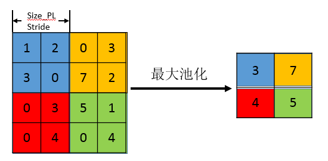
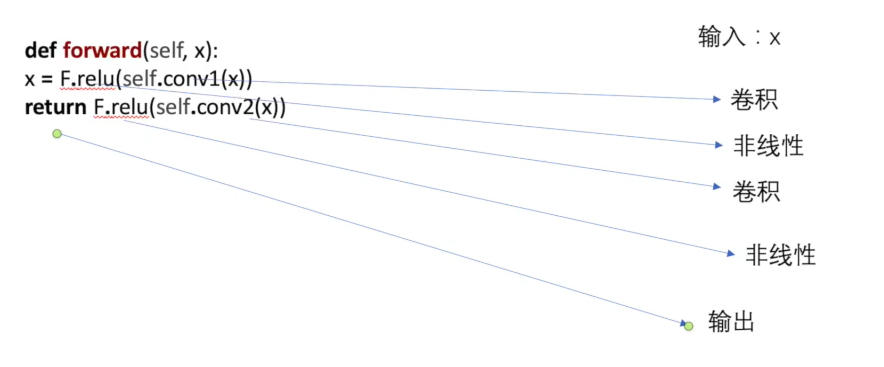
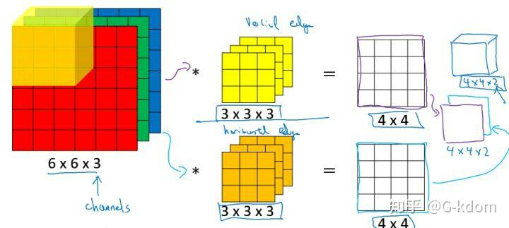
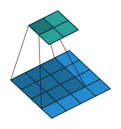
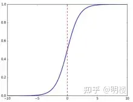

# pytorch学习 b站小土堆
## 1.dataset和dataloader

dataset是告诉程序数据集的一些具体参数，其实可以直接理解成数据集吧

dataload是从dataset中读取设置，比如一次读取四张

dataloader的具体工作形式如下图

batch_size设置为4就每次从dataset里面读取四张并打包

## 2.torch.nn
下图展示了自行搭建神经网络中的一些自定义函数操作

### ps：关于tensor张量的一些理解
 ->  

这个右图里面的代码是写入了一个二维矩阵，这个二维矩阵就是对应左图的里面的图像，然后并将其转化为二维tensor的数据类型。

对于这个又该怎么理解

四个参数分别解释为：图片数量、图片层数、长、宽
