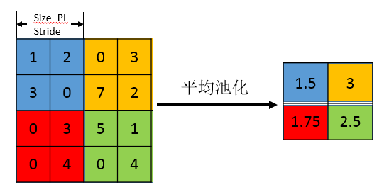

# pytorch学习 b站小土堆
## 1.dataset和dataloader的联系

dataset是告诉程序数据集的一些具体参数，其实可以直接理解成数据集吧

dataload是从dataset中读取设置，比如一次读取四张

dataloader的具体工作形式如下图

batch_size设置为4就每次从dataset里面读取四张并打包

dataloader返回的数据里面包含有图像以及对应的标签序号

## 2.torch.nn里面的一些函数和参数
下图展示了自行搭建神经网络中的一些自定义函数操作

### 2.1关于tensor张量的一些理解
 ->  

这个右图里面的代码是写入了一个二维矩阵，这个二维矩阵就是对应左图的里面的图像，然后并将其转化为二维tensor的数据类型。

对于这个又该怎么理解

四个参数分别解释为：图片数量、通道数、长、宽
(batch_size channel hight weight)
如果出现-1 意味着自动计算 而不是真的-1

1111

### 2.2池化操作--减少数据量
池化操作是类似取核内的最大值、最小值或者平均值，平均池化如下

padding（填充）：是否填充边界，默认是不填充的

ceil model：池化的时候遇到边界不足的情况是否保留比池化核小的里面的最值 true的时候保留 false就不保留

strid（步长）：核每次滑动的距离，一般默认是kenel_size，没必要每次1步，因为会有一些重复的池化操作
滑动卷积核时，我们会先从输入的左上角开始，每次往左滑动一列或者往下滑动一行逐一计算输出，我们将每次滑动的行数和列数称为stride

### 2.3卷积操作

深度学习里面所谓的卷积运算，其实它被称为互相关（cross-correlation）运算：将图像矩阵中，从左到右，由上到下，取与滤波器同等大小的一部分，每一部分中的值与滤波器中的值对应相乘后求和，最后的结果组成一个矩阵，其中没有对核进行翻转。卷积会影响原来图像中tensor的中的通道数

### 2.4多通道卷积
实际上，大多数输入图像都有 RGB 3个通道。这里就要涉及到“卷积核”和“filter”这两个术语的区别。在只有一个通道的情况下，“卷积核”就相当于“filter”，这两个概念是可以互换的。但在一般情况下，它们是两个完全不同的概念。每个“filter”实际上恰好是“卷积核”的一个集合，在当前层，每个通道都对应一个卷积核，且这个卷积核是独一无二的。

多通道卷积的计算过程：将矩阵与滤波器对应的每一个通道进行卷积运算，最后相加，形成一个单通道输出，加上偏置项后，我们得到了一个最终的单通道输出。如果存在多个filter，这时我们可以把这些最终的单通道输出组合成一个总输出。

这里我们还需要注意一些问题——滤波器的通道数、输出特征图的通道数。
至于下面的图中为什么卷积之后出来的3* 3 *3 之后变成了 4 * 4 我也不懂。

### 2.5非线性激活（ReLu，Sigmoid，Tanh）
激活函数是指在多层神经网络中，上层神经元的输出和下层神经元的输入存在一个函数关系，这个函数就是激活函数。如下图所示，上层神经元通过加权求和，得到输出值，然后被作用一个激活函数，得到下一层的输入值。引入激活函数的目的是为了增加神经网络的非线性拟合能力。

## 3.一些杂记
torchvision：专门用于处理是视觉的torch，里面有准备好的数据集，例如coco数据集

tensorboard：用于显示训练的一些损失函数的情况，我的理解就是显示张量的黑板

貌似torch里面都集成的都是一些类，具体使用还得要使用这些类来创造对象之后再通过对象来调用方法。具体有什么函数我不太记得了。

