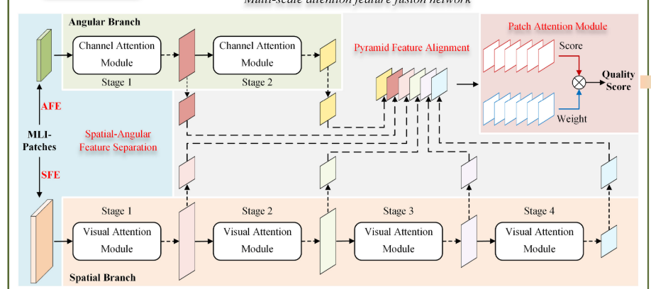
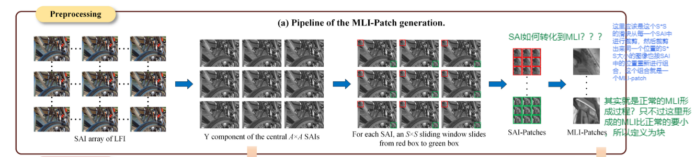
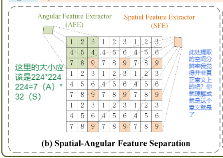

# MAFBLiF
这篇文章的总体框架如下：

这篇文章不是处理全部的SAI，而是只选择了A*A个。

这篇文章主要采用的是空间特征和角度特征分开处理，分别提出出来并命名为SFE和AFE。
## 1.首先选择一部分的A*A的SAIs图像进行重新组合，组合过程就是扣出每一个SAI中相同位置的块重新组合成一幅图像，之后将其转化为MLI图。

我觉得这个重新组合过程和PVBLiF很相似。前者分块处理 这个不分块处理，但是结果很相似。
这个MLI图之后就用做提取SFE和AFE的主体。

提取的过程如下所示：

    从图中就可以看出：
    角度信息就是相邻整块的SAI块之间的信息，
    空间信息就是所有SAI块之间同一位置像素的信息。

提取完了之后就将SAI图像转化为MLI图像之后丢入网络进行处理。
## 2.网络处理
网络的处理是空间SFE方面堆叠了四个一样的VAM模块处理
角度方面是堆叠了两个一样的通道注意力模块处理。
最后把所有的输出进行对齐。

## 3. Pooling过程
此处处理过程也是对MLI块处理
这里好像也是选择MLI块的显著性图最大的值当作这个块的分数权重然后对分数进行加权求和，之后得到整个的图像的评价分数。

但是这里丢弃的不是简单的方差，而是梯度图的方差。而且丢弃的阈值不是取方差的中值而是设定为0.4.

