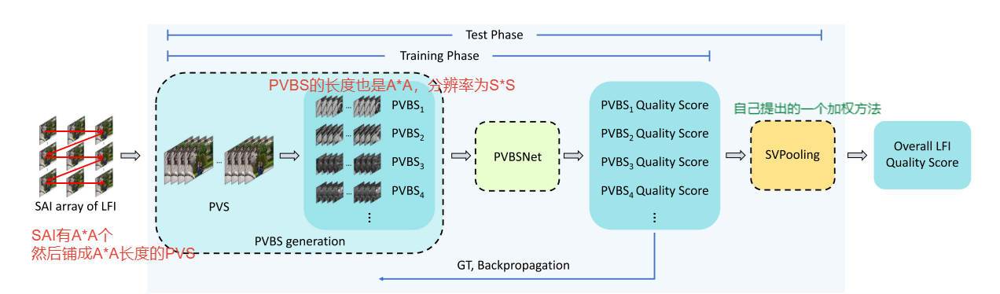
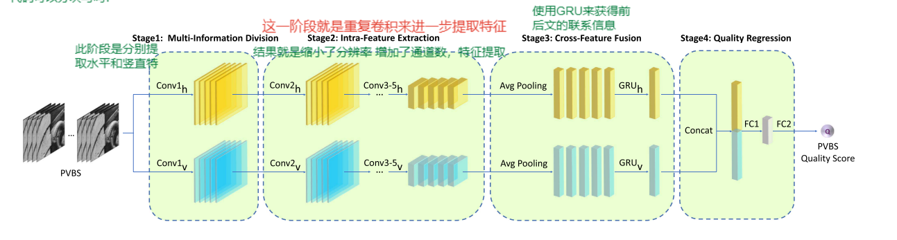

# PVBLiF
总体框架：

这篇文章处理了全部的SAI了吧？
## 1.所提出的PVBSNet网络架构如下：

第一阶段是获得水平和竖直的信息，（你可以换种方式）

第二阶段就是多次重复卷积来进一步提取特征，结果就是分辨率下降，通道数增多，（可以换）

第三阶段就是获取前后文之间的关系。（可以换模块）

第四阶段就是拼接质量评价（可以加强）
### 1.2关于如何得到水平和竖直的信息：

## 2.所提出的SVPooling方法（不涉及到训练）
这个方法其实就是给每一个PVBS块提供一个权重，
为了最后加权得到最终的整个图像的质量分数所提出的一个方法。根据显著性和方差来得到权重。
显著性通过生成显著图然后使用最大的那一个值,并且这个值就定义为这块PVBS的权重
方差是越高方法对质量评价越有利，因此舍弃方差小于中值的那些块
最终的得分就由权重乘对应的得分得到。
显著图是权重，方差是筛选。

（可以自己构造一套方法）