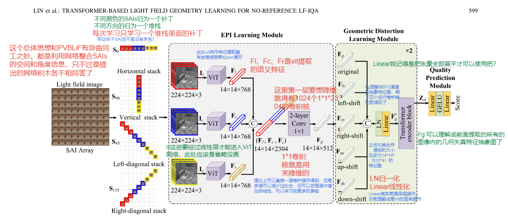

## Transformer-base
总体框架图如下所示：

这篇文章没有处理全部的SAI。而是只处理了一部分。

这篇文献对于SAI的处理方法有点简单粗暴，没有拆分成小块，而是直接进行了排列组合，具体来说
就是设置了四个堆栈，这四个堆栈分别是存储四个角度的SAI图像，相比PVBLiF方法可以获得45°和135°方向的角度信息。前者为什么要分成小块可能是为了增加输入增大数据集的缘故。

这个网络的奇葩之处在于一次只输入一个堆栈，然后一个方向的堆栈里面还分成三个补丁，每个补丁三块，来获取补丁之间的关系。

我觉得最好的操作是对Fg进行SST移位策略的那一步。在这里由于VIT只能获取不同token之间的关系但是获取不了一个token之间的关系，所以这里进行了移位操作。是一个很好的添笔。

最终的得分是由四个堆栈输入网络后得到的得分取平均得到的。（可以操作一个评分标准）